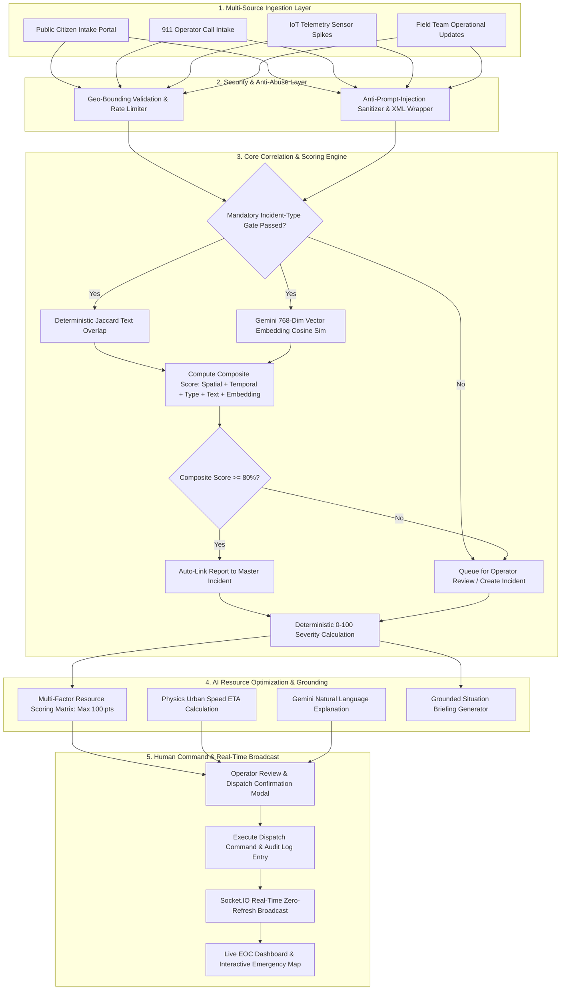

# SENTINEL — Smart Emergency Network & Triage Ingestion Layer

> **Next-Generation Civil Emergency Operations & Resource Intelligence Platform**

[](https://nodejs.org/)
[](https://www.typescriptlang.org/)
[](https://react.dev/)
[](https://vitejs.dev/)
[](https://www.mongodb.com/)
[](https://socket.io/)
[](https://ai.google.dev/)
[](https://tailwindcss.com/)

---

## 📌 About SENTINEL

**SENTINEL** (**Smart Emergency Network & Triage Ingestion Layer**) is an enterprise-grade civil Emergency Operations Center (EOC) coordination and resource intelligence platform. It unifies high-volume emergency data streams—public 911 calls, citizen web submissions, IoT sensor telemetry spikes, and field team updates—into a centralized real-time command console.

By pairing **deterministic mathematical triage engines** with **Google Gemini AI intelligence**, SENTINEL prevents emergency data fragmentation, automates duplicate incident detection, optimizes emergency resource dispatches, and provides grounded situation briefings while ensuring human dispatchers retain 100% operational command authority.

---

## ⚙️ Core Platform Features

### 📡 1. Multi-Channel Emergency Ingestion
- **Public Citizen Emergency Intake (`/report-emergency`)**: Dedicated public portal allowing citizens to file reports with photo attachments, category selection, and precise coordinate pickers.
- **Operator 911 Rapid Call Intake Modal**: Streamlined operator panel featuring live deterministic severity previews, proximity warnings, and instant resource recommendations.
- **Automated IoT Sensor Telemetry**: Continuous ingestion of seismic, gas, smoke, and flood sensor streams with sliding-window idempotency to suppress duplicate alert floods.
- **Field Team Mobile Updates**: Operational field updates for status shifts (`EN_ROUTE`, `ON_SCENE`, `RESOLVED`) and casualty counts.

### 🧠 2. Multi-Factor Correlation & Semantic Duplicate Detection
- **Multi-Factor Correlation Analyzer**: Evaluates incoming reports against active incidents across 5 dimensions:
  $$\text{Composite Score} = \text{Spatial (35)} + \text{Temporal (25)} + \text{Type Gate (15)} + \text{Text Overlap (12.5)} + \text{Vector Embedding (12.5)}$$
- **Mandatory Incident-Type Gate**: Enforces strict category compatibility before evaluating correlation. Mismatched incident types are immediately rejected.
- **High-Confidence Auto-Linking ($\ge 80\%$)**: Automatically links high-confidence civilian reports to active master incidents without creating duplicate emergency records.
- **Gemini Semantic Vector Embeddings**: Uses 768-dimension embeddings (`text-embedding-004`) and Cosine Vector Similarity ($\cos(\theta)$) to match semantically equivalent reports.
- **Human-Confirmed Incident Merging**: Merging two active master incidents requires explicit human operator confirmation.

### 🎯 3. Deterministic 0–100 Emergency Severity Engine
- **Transparent Triage Matrix**: Physics-based 0–100 severity calculation algorithm.
- **Mutually Exclusive Casualty Tiers**: 3+ casualties (+25 pts), 1–2 casualties (+15 pts), 0 casualties (+0 pts).
- **Single-Credit Hazard Modifiers**: Capped at 35 points max (Explosion +25, Toxic Chemical +20, Trapped Persons +15, Fire Spreading +10).
- **Hard Score Ceiling**: Scores strictly capped at 100 points to prevent arbitrary score inflation.

### 🚑 4. Ranked Resource Optimization & Physics Urban Speed ETA
- **100-Point Resource Scoring Matrix**: Evaluates fleet availability across 4 dimensions:
  - **Proximity Score** (Max 40 pts): Haversine distance ($\le 1$km $\rightarrow 40$, $\le 3$km $\rightarrow 30$, $\le 7$km $\rightarrow 20$).
  - **Capability Match** (Max 30 pts): Primary capability match $\rightarrow 30$, secondary $\rightarrow 15$.
  - **Status & Capacity Subtotal** (Max 20 pts): `AVAILABLE` status (12 pts) + Crew sufficiency (8 pts).
  - **Sector Match** (Max 10 pts): Resource stationed in the target emergency zone.
- **Urban Speed ETA Model**: Physics-based travel model:
  $$\text{ETA (minutes)} = \text{Math.round}\left(\frac{\text{Distance (km)}}{35\text{ km/h}} \times 60\right) + 2\text{ min turnout delay}$$
- **Gemini Natural Language Explanations**: Natural language justifications generated for top recommended units.

### 🛡 5. Grounded AI Intelligence & Anti-Prompt-Injection
- **Anti-Prompt-Injection Boundary Wrappers**: Strips instruction override phrases (`System:`, `Ignore previous instructions`, `ADMIN_OVERRIDE`, `DAN:`) and wraps untrusted input inside XML boundary tags (`<untrusted_user_input>`).
- **Grounded Situation Summarizer**: Aggregates linked reports, telemetry, and audit logs into structured briefings: *Operational Overview*, *Confirmed Facts*, *Key Risks*, and *Uncertainties*.
- **Interactive AI Command Assistant (`/ai-assistant`)**: Grounded conversational EOC assistant strictly restricted to live database records. Responds with *"Insufficient data available in system records to answer this query."* if data is missing.

### 👨‍✈️ 6. Human-Controlled Dispatch Workflow
- **Human-in-the-Loop Policy**: Enforces the strict operational chain `AI Recommendation → Operator Review → Human Confirmation → Dispatch`.
- **Complete Audit Logging**: Every operational command, severity override, unit dispatch, and incident status change is logged with timestamp, actor role, and reason justification.

### ⚡ 7. Real-Time Zero-Refresh Dashboard
- **WebSocket Broadcast Engine**: Built on Socket.IO for immediate distribution of report creation, report linking, incident status changes, sensor telemetry, and severity recalculations across all connected EOC screens without page refreshes.

---

## 🏗 System Architecture & Workflow



---

## 🛠 Technology Stack

### Backend Infrastructure
- **Runtime**: Node.js `v20.x` (ES Modules)
- **Framework**: Express `v4.21.x` with TypeScript `v5.7.x`
- **Database**: MongoDB `v8.x` with Mongoose ODM (Geospatial 2dsphere & Compound Indexing)
- **Real-Time Communication**: Socket.IO `v4.8.x` (WebSocket server)
- **AI & Vector Embeddings**: Official `@google/genai` SDK (`gemini-2.0-flash` / `gemini-2.5-flash` and `text-embedding-004`)
- **Security & Middleware**: Zod `v3.24.x`, Helmet `v8.x`, CORS, JWT, Bcrypt, Custom Anti-Prompt Injection XML Wrapper
- **Logging & Tools**: Pino `v9.x`, Pino-Pretty, TSX Watch execution

### Frontend Command Interface
- **Core Library**: React `v18.x` with TypeScript
- **Build Tool**: Vite `v6.x`
- **Styling & Aesthetics**: Vanilla CSS Design System with TailwindCSS utility framework, dark mode glassmorphism
- **Iconography & UI**: Lucide React icons
- **State & Real-Time**: React Context API, Socket.IO Client `v4.8.x`, Axios HTTP Client

---

## 📦 Project Directory Structure

```
PS-9/
├── backend/                        # Express + TypeScript EOC Backend Engine
│   ├── src/
│   │   ├── config/                 # Environment variables & MongoDB config
│   │   ├── controllers/            # Auth, Incidents, Resources, Analytics, Intake, AI controllers
│   │   ├── middleware/             # JWT Auth, RBAC guards, Geo bounding, Rate limiter, Error handler
│   │   ├── models/                 # Incident, Report, Resource, Hospital, User, IncidentUpdate Mongoose schemas
│   │   ├── routes/                 # Express API routing modules (/api/v1/*)
│   │   ├── scripts/                # Seed script & automated Phase 2 / Phase 3 test suites
│   │   ├── services/               # Gemini SDK, Prompt Sanitizer, Entity Extraction,
│   │   │                           # Vector Embeddings, Correlation Engine, Severity Engine,
│   │   │                           # Resource Recommendation, Situation Summary, AI Assistant Services
│   │   ├── types/                  # Socket.IO event contracts & TypeScript declarations
│   │   ├── app.ts                  # Express application factory & middleware stack
│   │   └── server.ts               # HTTP server entry point & Socket.IO initialization
│   ├── package.json
│   └── tsconfig.json
│
├── frontend/                       # React 18 + Vite EOC Command Interface
│   ├── src/
│   │   ├── components/
│   │   │   ├── dashboard/          # Incident Feed, Map Panel, Resource Fleet, System Health, Simulator Bar
│   │   │   ├── detail/             # Incident & Resource Detail Drawers with AI Briefings
│   │   │   ├── layout/             # Header, Sidebar navigation, EOC layout
│   │   │   ├── modals/             # Operator Intake Modal, Correlation Review Modal
│   │   │   ├── resources/          # Resource Recommendation Cards with Human Confirmation Modal
│   │   │   └── ui/                 # Reusable Card, Button, Badge, Drawer, RoleGate components
│   │   ├── context/                # AuthContext, SocketContext, FilterContext
│   │   ├── pages/                  # DashboardPage, IncidentsPage, ResourcesPage, MapPage,
│   │   │                           # AnalyticsPage, CitizenReportPage, AIAssistantPage
│   │   ├── types/                  # Shared TypeScript interfaces
│   │   ├── App.tsx                 # Main application routes & layout
│   │   └── main.tsx                # DOM render entry point
│   ├── package.json
│   ├── vite.config.ts
│   └── tailwind.config.js
│
├── data/                           # Local MongoDB database persistence path
├── docker-compose.yml              # Container setup for local MongoDB deployment
└── README.md                       # Master Project Documentation
```

---

## ⚡ Quick Start & Installation Guide

### Prerequisites
- **Node.js**: `v20.x` or higher
- **npm**: `v10.x` or higher
- **MongoDB**: `v7.0+` running locally on port `27017` (or via Docker)

---

### Step 1: Clone Repository & Install Dependencies

```bash
# Clone the repository
git clone https://github.com/DhavalMaurya/Intelligent-Emergency-Response-Resource-Coordination-Platform.git
cd Intelligent-Emergency-Response-Resource-Coordination-Platform

# Install Backend dependencies
cd backend
npm install

# Install Frontend dependencies
cd ../frontend
npm install
```

---

### Step 2: Environment Configuration

Create a `.env` file in `backend/`:

```env
# Server Config
PORT=5000
NODE_ENV=development
CLIENT_URL=http://localhost:5173

# Database & Security
MONGODB_URI=mongodb://localhost:27017/ps9_emergency_demo
JWT_SECRET=dev_jwt_secret_ps9_local
JWT_EXPIRES_IN=24h

# Demo & Seeding
ENABLE_DEMO_SEEDING=true
DEMO_SEED_PASSWORD=demo_password_123

# Google Gemini AI Integration (Optional for live Gemini; falls back to deterministic rules if empty)
GEMINI_API_KEY=your_google_gemini_api_key_here
GEMINI_MODEL=gemini-2.0-flash
GEMINI_EMBEDDING_MODEL=text-embedding-004
```

Create a `.env` file in `frontend/`:

```env
VITE_API_URL=http://localhost:5000
VITE_SOCKET_URL=http://localhost:5000
```

---

### Step 3: Start MongoDB Server

If running standalone MongoDB locally:
```bash
mongod --dbpath "./data/db" --port 27017
```

Or using Docker Compose from the project root:
```bash
docker-compose up -d
```

---

### Step 4: Seed EOC Database

Populate the database with operational accounts, active incidents, fleet resources, regional hospitals, and sensor readings:

```bash
cd backend
npm run seed
```

*Demo Accounts Created:*
- **Operator**: `operator@ps9.demo` (Password: `demo_password_123`)
- **Supervisor**: `supervisor@ps9.demo` (Password: `demo_password_123`)
- **Field Team**: `field@ps9.demo` (Password: `demo_password_123`)
- **Admin**: `admin@ps9.demo` (Password: `demo_password_123`)

---

### Step 5: Launch Development Servers

Start Backend Express Server (Port `5000`):
```bash
cd backend
npm run dev
```

Start Frontend Vite Dev Server (Port `5173`):
```bash
cd frontend
npm run dev
```

Open your browser and navigate to: **`http://localhost:5173`**

---

## 🧪 Automated Testing & Build Validation

### Execute Phase 2 Test Suite
Validates public intake, geo-bounding, anti-abuse honeypot, rate-limiting, severity capping, Jaccard correlation, sensor repeat-reading suppression, and RBAC endpoints:
```bash
cd backend
npx tsx src/scripts/test-phase2.ts
```

### Execute Phase 3 Test Suite
Validates Gemini SDK health status, anti-prompt-injection XML wrapping, NLP entity extraction, Cosine vector embedding point calculations, mandatory incident-type gating, $80\%$ auto-linking, resource scoring matrix (0–100 cap), urban speed ETA model, grounded situation briefings, and assistant grounding:
```bash
cd backend
npx tsx src/scripts/test-phase3.ts
```

### Run Production TypeScript Builds
```bash
# Validate Backend TypeScript compilation
cd backend
npm run build

# Validate Frontend production bundle build
cd ../frontend
npm run build
```

---

## 🔐 Role-Based Access Control (RBAC) Matrix

| Action / Endpoint | Public / Citizen | Field Team | Operator | Supervisor / Control Room | Admin |
| :--- | :---: | :---: | :---: | :---: | :---: |
| **Public Citizen Emergency Intake** (`/report-emergency`) | ✅ | ✅ | ✅ | ✅ | ✅ |
| **View Dashboard & Operational Map** | ❌ | ✅ | ✅ | ✅ | ✅ |
| **Log 911 Rapid Emergency Call** | ❌ | ❌ | ✅ | ✅ | ✅ |
| **Manual Unit Dispatch & Acknowledge Call** | ❌ | ❌ | ✅ | ✅ | ✅ |
| **Override Incident Severity / Escalate** | ❌ | ❌ | ❌ | ✅ | ✅ |
| **Human Operator Incident Merging** (`/intake/correlate`) | ❌ | ❌ | ✅ | ✅ | ✅ |
| **AI Situation Briefings & Resource Optimization** | ❌ | ❌ | ✅ | ✅ | ✅ |
| **Grounded AI Command Assistant** (`/ai-assistant`) | ❌ | ❌ | ✅ | ✅ | ✅ |

---

## 📄 License & Attribution

This project is developed for the **PS-9 Emergency Response & Resource Intelligence Hackathon**.

**Repository**: [DhavalMaurya/Intelligent-Emergency-Response-Resource-Coordination-Platform](https://github.com/DhavalMaurya/Intelligent-Emergency-Response-Resource-Coordination-Platform)  
**System Name**: **SENTINEL — Smart Emergency Network & Triage Ingestion Layer**
