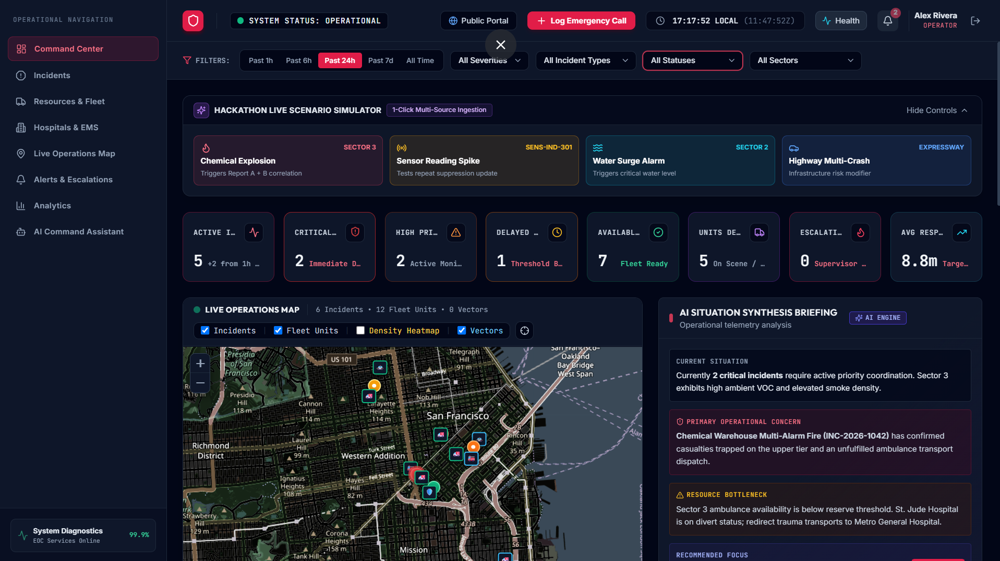
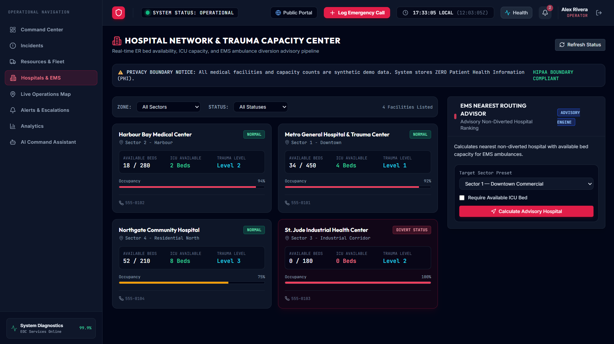
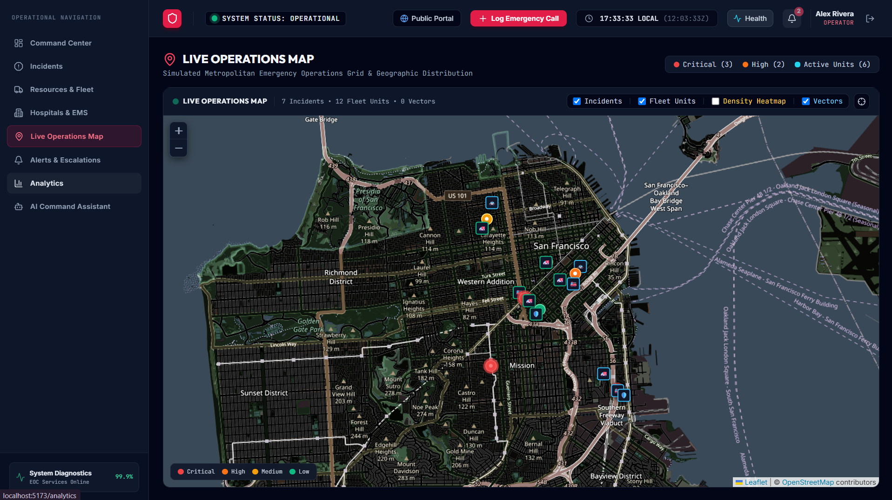
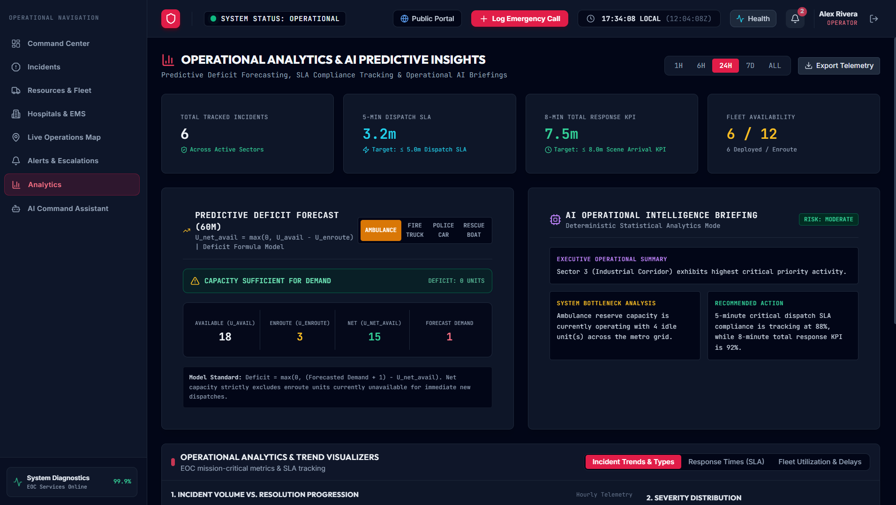
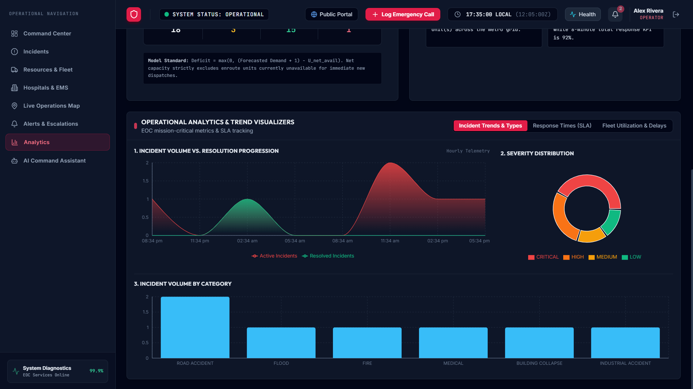
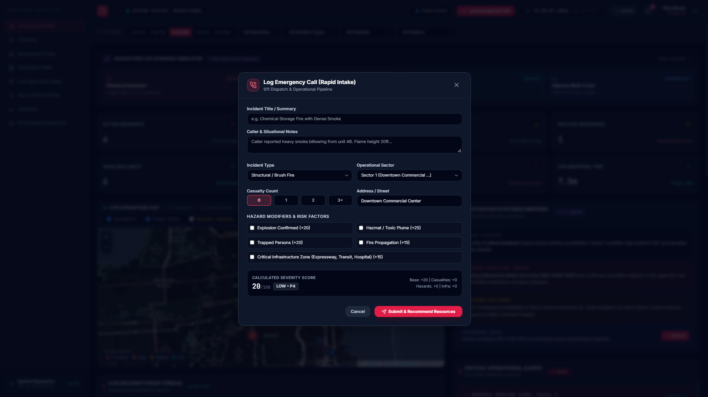
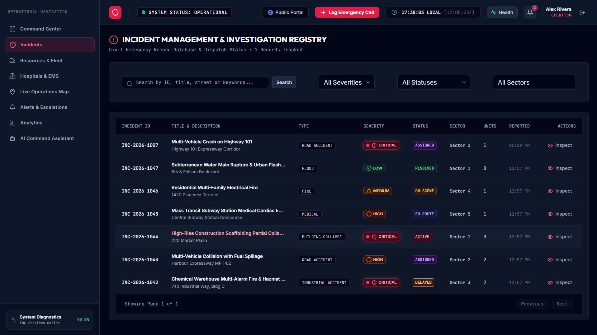
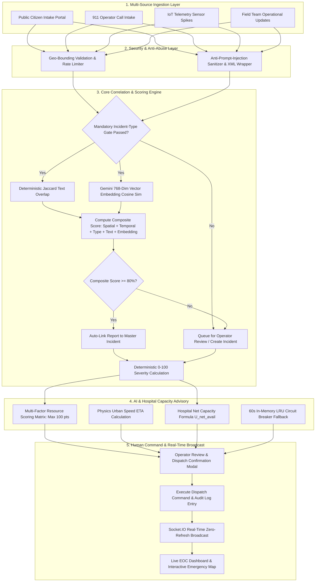

# SENTINEL — Smart Emergency Network & Triage Ingestion Layer

> **Next-Generation Civil Emergency Operations & Healthcare Resource Intelligence Platform**

[](https://nodejs.org/)
[](https://www.typescriptlang.org/)
[](https://react.dev/)
[](https://vitejs.dev/)
[](https://www.mongodb.com/)
[](https://socket.io/)
[](https://ai.google.dev/)
[](https://tailwindcss.com/)
[](#-automated-testing--build-validation)

---

## 📌 About SENTINEL

**SENTINEL** (**Smart Emergency Network & Triage Ingestion Layer**) is an enterprise-grade civil Emergency Operations Center (EOC) coordination and resource intelligence platform built for **BIT N BUILD ’26 (Problem Statement PS-9)**. It unifies high-volume emergency data streams—public 911 calls, citizen web submissions, IoT sensor telemetry spikes, and field team updates—into a centralized real-time command console.

By pairing **deterministic mathematical triage engines** with **Google Gemini 3.6 Flash AI intelligence**, SENTINEL prevents emergency data fragmentation, automates duplicate incident detection, optimizes emergency resource dispatches, and provides dynamic hospital capacity advisories while ensuring human dispatchers retain 100% operational command authority.

---

## 📄 Submission Artifacts & Deck Links

* **Presentation Deck Content (8 Guidelines):** [`pptContent.md`](pptContent.md)
* **Demo Video Recording Walkthrough & Script:** [`demo_video_script.md`](demo_video_script.md)
* **Project Repository:** [GitHub - DhavalMaurya/Intelligent-Emergency-Response-Resource-Coordination-Platform](https://github.com/DhavalMaurya/Intelligent-Emergency-Response-Resource-Coordination-Platform)

---

## 📸 Application Interface & System Walkthrough

### 1. Command Center Dashboard
Central EOC command overview showing live active incidents, priority breakdown, response time metrics, and system diagnostics.


### 2. Incident & Emergency Intake Management
Operator call intake panel with real-time AI severity scoring, hazard detection, and duplicate report auto-linking.


### 3. Hospital Capacity & Trauma Advisory System
Live bed and ICU management matrix with $U_{\text{net\_avail}}$ Net Capacity calculations and automatic shortage warning alerts.


### 4. Live Operations Map & Geospatial Tracking
Interactive Leaflet GIS map with spatial indexing, turn-by-turn paramedic dispatch, and sub-200ms WebSocket updates.


### 5. Analytics & Incident Heatmaps
Historical response trends, sector incident density heatmaps, and resource utilization charts.


### 6. AI Command Assistant
Grounded NLP assistant strictly queryable against active database records with anti-prompt-injection boundary safeguards.


### 7. EOC System Diagnostics & Health Modal
Real-time diagnostic panel displaying database connection health, socket latency, and 60-second LRU circuit breaker fallback status.


---

## ⚙️ Core Platform Features

### 📡 1. Multi-Channel Emergency Ingestion
- **Public Citizen Emergency Intake (`/report-emergency`)**: Dedicated public portal allowing citizens to file reports with photo attachments, category selection, and precise coordinate pickers.
- **Operator 911 Rapid Call Intake Modal**: Streamlined operator panel featuring live deterministic severity previews, proximity warnings, and instant resource recommendations.
- **Automated IoT Sensor Telemetry**: Continuous ingestion of seismic, gas, smoke, and flood sensor streams with sliding-window idempotency to suppress duplicate alert floods.
- **Field Team Mobile Updates**: Operational field updates for status shifts (`EN_ROUTE`, `ON_SCENE`, `RESOLVED`) and casualty counts.

### 🧠 2. Multi-Factor Correlation & Semantic Duplicate Detection
- **Multi-Factor Correlation Analyzer**: Evaluates incoming reports against active incidents across 5 dimensions:
  $$\text{Composite Score} = \text{Spatial (35)} + \text{Temporal (25)} + \text{Type Gate (15)} + \text{Text Overlap (12.5)} + \text{Vector Embedding (12.5)}$$
- **Mandatory Incident-Type Gate**: Enforces strict category compatibility before evaluating correlation. Mismatched incident types are immediately rejected.
- **High-Confidence Auto-Linking ($\ge 80\%$)**: Automatically links high-confidence civilian reports to active master incidents without creating duplicate emergency records.
- **Gemini Semantic Vector Embeddings**: Uses 768-dimension embeddings (`text-embedding-004`) and Cosine Vector Similarity ($\cos(\theta)$) to match semantically equivalent reports.

### 🎯 3. Deterministic 0–100 Emergency Severity Engine
- **Transparent Triage Matrix**: Physics-based 0–100 severity calculation algorithm.
- **Mutually Exclusive Casualty Tiers**: 3+ casualties (+25 pts), 1–2 casualties (+15 pts), 0 casualties (+0 pts).
- **Single-Credit Hazard Modifiers**: Capped at 35 points max (Explosion +25, Toxic Chemical +20, Trapped Persons +15, Fire Spreading +10).
- **Hard Score Ceiling**: Scores strictly capped at 100 points to prevent arbitrary score inflation.

### 🚑 4. Ranked Resource Optimization & Urban Speed ETA
- **100-Point Resource Scoring Matrix**: Evaluates fleet availability across 4 dimensions:
  - **Proximity Score** (Max 40 pts): Haversine distance ($\le 1$km $\rightarrow 40$, $\le 3$km $\rightarrow 30$, $\le 7$km $\rightarrow 20$).
  - **Capability Match** (Max 30 pts): Primary capability match $\rightarrow 30$, secondary $\rightarrow 15$.
  - **Status & Capacity Subtotal** (Max 20 pts): `AVAILABLE` status (12 pts) + Crew sufficiency (8 pts).
  - **Sector Match** (Max 10 pts): Resource stationed in the target emergency zone.
- **Urban Speed ETA Model**: Physics-based travel model:
  $$\text{ETA (minutes)} = \text{Math.round}\left(\frac{\text{Distance (km)}}{35\text{ km/h}} \times 60\right) + 2\text{ min turnout delay}$$

### 🏥 5. Hospital Capacity & Dynamic Advisory Model (Phase 5)
- **Net Available Capacity Formula ($U_{\text{net\_avail}}$)**: Prevents ER overcrowding by evaluating live bed availability:
  $$\text{U}_{\text{net\_avail}} = \text{Beds}_{\text{avail}} + \text{ICU}_{\text{avail}} - \text{ActiveIncidents} - U_{\text{enroute}}$$
- **Shortage Warning Trigger**: Automatically triggers a `SHORTAGE_WARNING` status badge when $\text{U}_{\text{net\_avail}} \le 0$ and redirects incoming trauma dispatches.
- **Strict Coordinate & ICU Bounds**: Validates hospital coordinates within valid $[lng, lat]$ ranges and enforces $\text{ICU}_{\text{avail}} \le \text{TotalBeds}$.

### ⚡ 6. High-Availability Circuit Breaker & LRU Cache (Phase 5)
- **Monitored DB Latency Threshold**: 3,000ms.
- **Automatic Fallback Engine**: If database latency exceeds 3 seconds or a connection failure occurs, SENTINEL instantly switches to a **60-second In-Memory LRU Cache**, serving static health status and hospital analytics with zero request failures.

### 🛡 7. Grounded AI Intelligence & Anti-Prompt-Injection
- **Anti-Prompt-Injection Boundary Wrappers**: Strips instruction override phrases (`System:`, `Ignore previous instructions`, `ADMIN_OVERRIDE`, `DAN:`) and wraps untrusted input inside XML boundary tags (`<untrusted_user_input>`).
- **Grounded Situation Summarizer**: Aggregates linked reports, telemetry, and audit logs into structured briefings: *Operational Overview*, *Confirmed Facts*, *Key Risks*, and *Uncertainties*.

---

## 🏗 System Architecture & Workflow



---

## 🛠 Technology Stack

### Backend Infrastructure
- **Runtime**: Node.js `v20.x` (ES Modules)
- **Framework**: Express `v4.21.x` with TypeScript `v5.7.x`
- **Database**: MongoDB `v8.x` with Mongoose ODM (`2dsphere` Geospatial & Compound Indexing)
- **Real-Time Engine**: Socket.IO `v4.8.x` (WebSocket server, sub-200ms latency)
- **AI & Vector Embeddings**: Official `@google/genai` SDK (`gemini-3.6-flash` and `text-embedding-004`)
- **Resilience**: 60-second In-Memory LRU Cache Circuit Breaker
- **Security & Middleware**: Zod `v3.24.x`, Helmet `v8.x`, CORS, JWT, Bcrypt, Custom Anti-Prompt Injection XML Wrapper

### Frontend Command Interface
- **Core Library**: React `v18.x` with TypeScript
- **Build Tool**: Vite `v6.x`
- **Styling & Aesthetics**: Dark mode glassmorphic UI, TailwindCSS, Lucide Icons, Leaflet GIS Maps
- **State & Real-Time**: React Context API, Socket.IO Client `v4.8.x`, Axios HTTP Client

---

## ⚡ Quick Start & Installation Guide

### Prerequisites
- **Node.js**: `v20.x` or higher
- **npm**: `v10.x` or higher
- **MongoDB**: `v7.0+` running locally on port `27017` (or via Docker)

---

### Step 1: Clone Repository & Install Dependencies

```bash
# Clone the repository
git clone https://github.com/DhavalMaurya/Intelligent-Emergency-Response-Resource-Coordination-Platform.git
cd Intelligent-Emergency-Response-Resource-Coordination-Platform

# Install Backend dependencies
cd backend
npm install

# Install Frontend dependencies
cd ../frontend
npm install
```

---

### Step 2: Environment Configuration

Create a `.env` file in `backend/`:

```env
# Server Config
PORT=5000
NODE_ENV=development
CLIENT_URL=http://localhost:5173

# Database & Security
MONGODB_URI=mongodb://localhost:27017/ps9_emergency_demo
JWT_SECRET=dev_jwt_secret_ps9_local
JWT_EXPIRES_IN=24h

# Demo & Seeding
ENABLE_DEMO_SEEDING=true
DEMO_SEED_PASSWORD=demo_password_123

# Google Gemini AI Configuration
GEMINI_API_KEY=your_google_gemini_api_key_here
GEMINI_MODEL=gemini-3.6-flash
GEMINI_EMBEDDING_MODEL=text-embedding-004
```

Create a `.env` file in `frontend/`:

```env
VITE_API_URL=http://localhost:5000
VITE_SOCKET_URL=http://localhost:5000
```

---

### Step 3: Launch Development Servers

Start Backend Express Server (Port `5000`):
```bash
cd backend
npm run dev
```

Start Frontend Vite Dev Server (Port `5173`):
```bash
cd frontend
npm run dev
```

Open your browser and navigate to: **`http://localhost:5173`**

---

## 🧪 Automated Testing & Verification Commands

All core modules, AI integrations, socket events, and resilience fallbacks have automated TypeScript test scripts:

```bash
# 1. Live Gemini AI Key & Model Verification
cd backend
npx tsx src/scripts/test-ai-key.ts

# 2. Execute Phase 2 Test Suite (Intake, Anti-Abuse, Telemetry)
npx tsx src/scripts/test-phase2.ts

# 3. Execute Phase 3 Test Suite (31/31 Passed — AI Triage, Vectors, Resource Matrix)
npx tsx src/scripts/test-phase3.ts

# 4. Execute Phase 4 Test Suite (17/17 Passed — Socket Gateway, Bounds, Sanitizer)
npx tsx src/scripts/test-phase4.ts

# 5. Execute Phase 5 Test Suite (10/10 Passed — LRU Circuit Breaker & Hospital U_net_avail)
npx tsx src/scripts/test-phase5.ts
```

---

## 📄 License & Hackathon Attribution

This project is developed for **BIT N BUILD ’26 GUJARAT ROUND** (Problem Statement PS-9).

**Repository**: [DhavalMaurya/Intelligent-Emergency-Response-Resource-Coordination-Platform](https://github.com/DhavalMaurya/Intelligent-Emergency-Response-Resource-Coordination-Platform)  
**System Name**: **SENTINEL — Smart Emergency Network & Triage Ingestion Layer**
